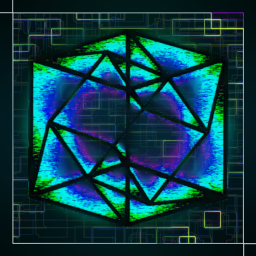

> # [Quantum Dimensions](https://modrinth.com/mod/quantum-dimensions)  
>   
> Travel to different dimensions and discover new op entities, blocks and items
**Quantum Dimensions is currently in an alpha stage and stuff are being updated all the time.**  
 
<b>Quantum Dimensions</b>, a Minecraft mod that transforms the game into a vast, challenging multiverse filled with unique, resource-rich dimensions beyond the standard Overworld, Nether, and End. 
Players must master complex quantum technology and construct powerful portals to navigate these new worlds, explore new structures and meet new challenging bosses and defeat them for tresures worth more than netherite.

## 🖼️ Gallery

